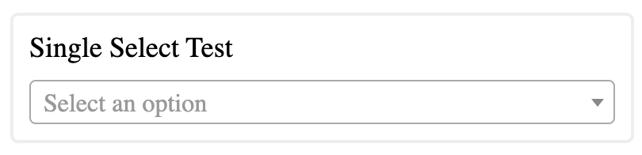
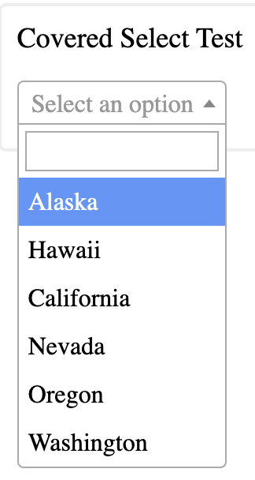

# select2-java-selenium
## Java-Selenium library for operating [Select2](/https://select2.org/) elements

### This library can be integrated into Java-Selenium based framework for effective and efficient usage of `Select2` element, similar to default [selenium.webdriver.support.select](/https://www.selenium.dev/selenium/docs/api/py/webdriver_support/selenium.webdriver.support.select.html/) implementation

[](http://search.maven.org/#search|ga|1|g:"io.github.eotsevych")
[](http://www.oracle.com/technetwork/java/javase/downloads/index.html)
[](https://app.codacy.com/gh/eotsevych/select2-java-selenium/dashboard?utm_source=gh&utm_medium=referral&utm_content=&utm_campaign=Badge_grade)
[](https://opensource.org/licenses/MIT)

### Usage
For maven based project add the below dependency
```xml
<dependency>
    <groupId>io.github.eotsevych</groupId>
    <artifactId>select2-java-selenium</artifactId>
    <version>1.1.4</version>
</dependency>
```
For gradle based project add the below dependency
```
implementation 'io.github.eotsevych:select2-java-selenium:1.1.4'
```

### Why this library designed for?
###### Problem Statement:
When working with Selenium WebDriver, the default class for interacting with select tags fell short in handling custom Select2 elements on webpages. Despite the commonality in the structure of Select2 elements across different websites, the standard WebDriver class was unable to effectively manage hidden select elements present in the DOM.
###### Solution:
To address this issue, a specialized Select2 Java-Selenium library was developed. This library provides an efficient and effective solution for interacting with Select2 elements by overcoming the limitations of the default WebDriver class. The decision to create a custom library was guided by the recognition of a shared structure among Select2 elements on various websites, enabling the development of a generic solution.


#### Example `WebDriver`
```
WebElement selectElement = driver.findElement(By.name("selectomatic"));
Select select = new Select(selectElement);
```

#### Solution for `Select2`
```
WebElement selectElement = driver.findElement(By.name("selectomatic"));
Select2 select = new Select2(selectElement);
```

### Features
1. Simple to well-known WebDriver implementation
2. Wider functionality range
3. Open source


### Available methods
- `selectByText` - Select option by visible text
  - As input argument receive both `String` or `List<String>` in case multiple selection
- `selectByIndex` - Select option position number
  - Counting starts from `1`
  - As input argument receive both `int` or `int[]` in case multiple selection
- `isOptionDisabledByText` - return `boolean` status of option's disables
- `isOptionPresentByText` - return `boolean` status of option's presents
- `removeSelectedOption` - remove selected option from single select
- `removeAllSelectedOptions` - remove all selected options from multi select
- `removeSelectedOptions` - remove selected options from multi select according to `List<String> selectedOptions`
- `getSelectedOptionText` - return text from selected option as `T`
- `getMultiSelectedOptionsText` - - return text from all selected option as `List<T>`

Most of `select` method have additional `boolean... isOpened` argument. It's designed for cases, when your `Select2` element is hidden by any button, and for expanding the option list, you need to click on the button first. 
###### Regular Select2 element


###### Covered Select2 element


And after clicking at button the option list becase vibile



Unfortunately, such kind of clicking cannot be handled with build-in solution because of unique locator of your element. Solution required to click on the button as additional step
```
WebElement buttonElement = driver.findElement(By.id("buttonId"));
buttonElement.click()
WebElement selectElement = driver.findElement(By.name("selectomatic"));
Select2 select = new Select2(selectElement);
select.selectByText(text, true)
```

## Example

```java
import org.openqa.selenium.By;
import org.openqa.selenium.WebDriver;
import org.openqa.selenium.WebElement;
import org.openqa.selenium.chrome.ChromeDriver;
import org.openqa.selenium.support.ui.WebDriverWait;
import io.eotsevych.select2.Select2;

public class Select2Example {
    public static void main(String[] args) {
        ChromeOptions chromeOptions = new ChromeOptions();
        chromeOptions.addArguments("--disable-gpu", "--window-size=1920,1200", "--ignore-certificate-errors", "--disable-extensions", "--no-sandbox", "--disable-dev-shm-usage");

        WebDriver driver = new ChromeDriver(chromeOptions);
        WebDriverWait wait = new WebDriverWait(driver, 5);

        // Locate your Select2 element
        WebElement selectElement = driver.findElement(By.id("yourSelect2ElementId"));

        // Initialize Select2 instance
        Select2 select2 = new Select2(selectElement, wait);

        // Example: Select options by text
        select2.selectByText("Option1", true, true);

        // Example: Verify if an option is disabled
        boolean isDisabled = select2.isOptionDisabledByText("Option2", false);

        // Example: Get list of selected options
        List<String> selectedOptions = select2.getMultiSelectedOptionsText();

        // Perform additional actions as needed...

        // Close the browser
        driver.quit();
    }
}
```